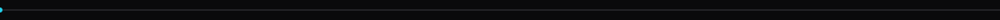

Started in Scratch, moved through Replit, then shipped Chrome extensions, full websites, full web apps, and a Solana Telegram trading bot. Self-taught. I build end to end and I finish.

### Stack

<table>
  <tr>
    <td align="center"><b>TypeScript</b></td>
    <td align="center"><b>JavaScript</b></td>
    <td align="center"><b>Python</b></td>
    <td align="center"><b>Node.js</b></td>
    <td align="center"><b>React</b></td>
    <td align="center"><b>HTML</b></td>
    <td align="center"><b>CSS</b></td>
    <td align="center"><b>Git</b></td>
    <td align="center"><b>Docker</b></td>
    <td align="center"><b>Postgres</b></td>
    <td align="center"><b>Redis</b></td>
    <td align="center"><b>Linux</b></td>
  </tr>
  <tr>
    <td align="center"><kbd>TS</kbd></td>
    <td align="center"><kbd>JS</kbd></td>
    <td align="center"><kbd>PY</kbd></td>
    <td align="center"><kbd>NODE</kbd></td>
    <td align="center"><kbd>RE</kbd></td>
    <td align="center"><kbd>HTML</kbd></td>
    <td align="center"><kbd>CSS</kbd></td>
    <td align="center"><kbd>GIT</kbd></td>
    <td align="center"><kbd>DKR</kbd></td>
    <td align="center"><kbd>PG</kbd></td>
    <td align="center"><kbd>RDS</kbd></td>
    <td align="center"><kbd>LX</kbd></td>
  </tr>
</table>

### Featured

<table>
  <tr>
    <td width="50%" valign="top">
      <b>Solana Telegram Trading Bot</b> 
      Reads the chain in real time and fires trades straight from Telegram in milliseconds. Wallet tracking, auto-buys, on-chain confirmations. The flagship.  
      <a href="[LINK]"><kbd> repo </kbd></a>
    </td>
    <td width="50%" valign="top">
      <b>Chrome Extension</b> 
      Injects clean UI into the pages people already live on and moves data where it needs to go. Lean, quiet, no permission bloat.  
      <a href="[LINK]"><kbd> repo </kbd></a>
    </td>
  </tr>
  <tr>
    <td width="50%" valign="top">
      <b>Full Web App</b> 
      End to end product: typed API, React front end, Postgres and Redis behind it. Auth, state, and deploy handled by me.  
      <a href="[LINK]"><kbd> repo </kbd></a>
    </td>
    <td width="50%" valign="top">
      <b>[your flagship - fill in]</b> 
      The one you want people to click first. Replace this with the project that proves the point.  
      <a href="[LINK]"><kbd> repo </kbd></a>
    </td>
  </tr>
</table>

### Contact

<a href="https://t.me/jugugalu"><kbd> Telegram </kbd></a>  &nbsp; <a href="https://github.com/tbzlucas"><kbd> GitHub </kbd></a>

